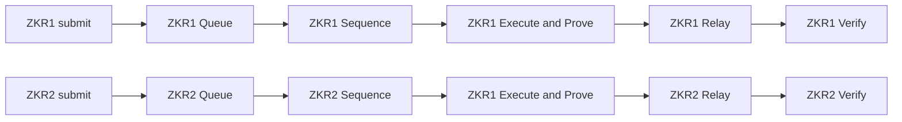
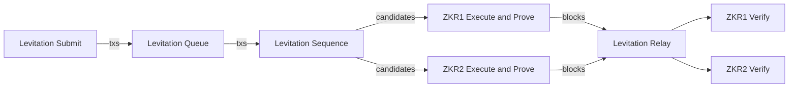
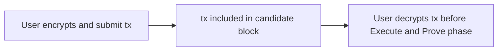

# Levitation Decentralized ZK rollup sequencer

## Three challenges Levitation solves

**ZK-rollups** (ZKRs) are **Layer 2 solutions** that use cutting edge mathematics of **ZK proofs** to **execute** and **prove** transactions in ZK-EVMs outside of Ethereum mainnet, and then
**post transaction data and ZK-proofs to the mainnet for verification**.  ZKRs inherit the **full security guarantees of the mainnet**.

**The purpose of Levitation protocol is to enable wide spread adoption of ZKRs** by addressing the following challenges:

1. **Centralization**: ZKRs presently running in production tend to be centralized.

2. **Fragmentation**: there is a large number of actively developed ZKR projects. Dapps need a modular interoperability layer, where different ZKRs can run seamlessly.

3. **Isolation**: ZKRs do not have access to the state of each other. This makes secure cross-ZKR interactions, such as token transfers, hard to implement.


## Levitation solution

Levitation protocol addresses the above challenges by describing an implementation a **decentralized sequencer** as **a set of smart contracts deployed to a high-performance EVM-compatible blockchain**. 

The sequencer protocol has pluggable **modular architecture**, enabling **existing ZKRs** to run seamlessly on chains implementing Levitation protocol.


Here are the three main advantages of Levitation

1. **Decentralization**: Existing ZKRs, when executed on Levitation, become decentralized, without requiring any modifications to the underlying software.

2. **Interoperability and Modularity**:  Levitation turns existing ZKRs into modules that interact with each other seamlessly.

3. **Common security**: Multiple ZKRs can run in a common environment of a single Levitation-enabled chain. This enables a common ledger of transactions and eases interaction of rollups.


We target the maximum simplicity and ETH-compatibility of the protocol, so it can run on a wide variety of existing and new ETH-compatible blockchains.


```markmap
# Levitation Protocol

## Decentralization

- running on blockchain
- implemented as smartcontracts

## Interoperability and Modularity

- Turns existing ZKRs into pluggable modules
- Uses standard Solidity tools and libraries

## Common security
- Can run multiple ZK-rollups on a single Levitation chain
- Provides common transactions ledger and state info
```


## Protocol overview


Existing ZKRs implement six stages:

```markmap
# ZKR

## Transaction submission

## Pending queue

## Sequence transactions


## Execute and prove

## Relay to mainnet

## Verify ZK-proofs

```


1. **Submission**: users submit transactions
2. **Pending queue**: transactions placed into a queue
3. **Sequence transactions**: transactions ordered into  block candidates
4. **Execute and prove**: block candidates are executed and injected with ZK proofs to yield ZK-blocks
5. **Relay to mainnet**: ZK-blocks are posted to the verifier contract on the mainnet.
6. **Verify ZK-proofs**: ZK-proofs are verified the verifier contract

Levitation protocol creates a **universal interoperable layer to take care of steps 1, 2,  and 4**. Existing ZKRs are then plugged into Levitation-enabled chains to perform Step 4 **Execute and prove** and Step 6 **Verify ZK-proofs**.


### Before and after comparison

The diagrams below illustrate execution of **two ZKRs (ZKR1 and ZKR2)** before and after introduction of Levitation.


**Before Levitation**, each of the ZKRs implements the six stages




**After Levitation**, each ZKR needs to **implement stage 4 and 6 as a Levitation module**, while the **remaining stages are implemented by Levitation**.

In other words, Levitation handles **transaction acceptance, ordering, and network relay**, while ZKRs handle ZK-related operations **(execution, proving and verification)**.





## Minimalistic design

We target minimalistic protocol  design **focusing on implementation speed, simplicity and security.**  **A small team of engineers** should be able to efficiently implement Levitation using **existing opensource libraries and tools**. 

We also aim to minimize time required to a new ZKR implementation to Levitation.


## Security-first Solidity

Security-relevant source code of Levitation is **implemented in Solidity** and deployed  as a **set of smart contracts** to an EVM-compatible chain. 

Using **existing Solidity tools and libraries** enables fast and secure implementation of the protocol as well **efficient third party audits**.


## Flexible performance vs security

Levitation protocol is designed to run runs on a **high-performance, fast-finality, decentralized EVM chain**.


When running on a Levitation-enabled chain, Dapps can **utilize the Levitation chain itself** for **fast interactive transactions** that **do not require security guarantees of the mainnet**. 

To enable this functionality Levitation introduces programming abstractions of **ZKChain** and **FastChain**. 

```markmap
# Levitation

## ZKChain: high security transactions, equivalent to ETH mainnet
## FastChain: fast interactive transactions
```


Dapps running on a Levitation-enabled chain see Levitation as two chains **ZKChain** and **FastChain**, connected by a bridge. Dapps can take advantage of high security of **ZKChain** and high performance of **FastChain**.

As an example, a web3 game will use **ZKChain** to mint NFTs, while implementing interactive gaming dynamics on **FastChain**.


## Transparent MEV protection


Levitation protocol **orders transactions on chain** before passing them to an ZKR implementation.

This enables **a simple and powerful protection mechanism against front running and MEV** that does not require modification of ZKR implementation. We call it **Transparent Transaction Encryption (TTE)**.

A user:

* **encrypts a transaction** and submits it (Stage 1)
* Transaction is stored in the pending queue (Stage 2)
* Levitation **creates a candidate block** (Stage 3)
* User **decrypts the transaction** just before the candidate block is passed to Stage 4
* Since at this point the transaction is decrypted, **Stage 4, 5, and 6 are executed on the plaintext transaction**. 


    

Since the transaction **is decrypted after it has been included in a block candidate**, the user is protected against front running and MEV. In particular, it is **too late** for other users to insert transactions in front of the user transaction.


# High Level Architecture  

High Level Architecture for  protocol is illustrated below 


* Users **submit transactions to ZKQueue contract** on Levitation chain
* ZKQueue contract **validates transactions** and stores them, **ordering them in the order of receipt in a single ledger**, splitting them logically into ZKBlockCandidates.
* **ZKProcessor agents** pull ZKBlockCandidates from ZKQueue
* **ZKProcessor agents** use **rollup-specific software (RSS)** plugin modules to execute and prove ZKBlockCandidates, **creating ZKBlocks**. 
* **ZKProcessor agents** push ZKBlocks to the **ZKBlocksStorage contract** on the Levitation chain, where they are **verified and stored**.
* ZKRelay agents push ZKBlocks to the corresponding **Rollup-specific Verifier Bridge contract (RSVBC)**, that verifies ZKBlocks and bridges tokens from/to ETH mainnet.


